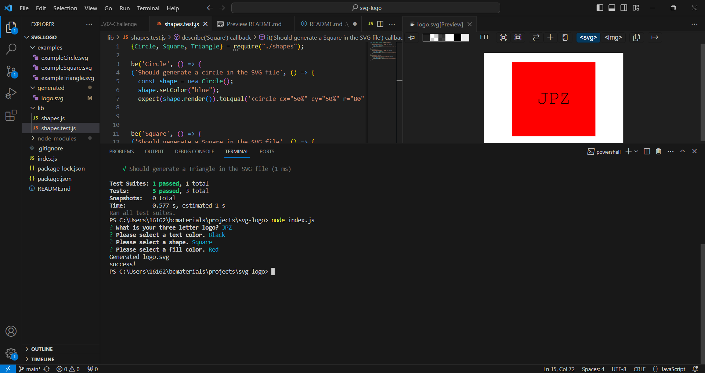

# SVG Logo Generator - John Zigterman

## Description

- I wanted to make a command line interface that would generate a three letter logo over a shape.
- This generator takes user input to determine four factors: text, text color, shape, and shape color.
- Using those four user inputs, the program generates a logo with the appropriate features as an svg file.
- The generator uses inquirer, jest, and inquirer-maxlength-input-prompt.
- The user interface is a simple prompt in the console.
- The user can also test the shape objects from directly in the console.

## Installation

This node.js application requires the user to use node and to install inquirer and two other packages in the parent folder for the prompts to function. The gitignore file is already formatted to ignore "node_modules" and ".DS_Store". It can be accessed easily from any command line once installation is complete.

## Usage

In order to generate the logo, a user will simply type "node index.js" in the command line. To initiate the shape object tests, they can type "npm test".

## Credits

I, John Paul Zigterman, completed this project by myself with the aid of the resources provided to me by the MSU coding bootcamp.

## Link

https://github.com/JohnPaulZigterman/svg-logo

## Screenshot

## Demonstration Video

[Demonstration Video Link](https://drive.google.com/file/d/1qeI7MKY2vhkKfMauvAAgPlElupS2kbnU/view?usp=sharing)

## License

MIT License

Copyright (c) 2023 John Paul Zigterman

Permission is hereby granted, free of charge, to any person obtaining a copy
of this software and associated documentation files (the "Software"), to deal
in the Software without restriction, including without limitation the rights
to use, copy, modify, merge, publish, distribute, sublicense, and/or sell
copies of the Software, and to permit persons to whom the Software is
furnished to do so, subject to the following conditions:

The above copyright notice and this permission notice shall be included in all
copies or substantial portions of the Software.

THE SOFTWARE IS PROVIDED "AS IS", WITHOUT WARRANTY OF ANY KIND, EXPRESS OR
IMPLIED, INCLUDING BUT NOT LIMITED TO THE WARRANTIES OF MERCHANTABILITY,
FITNESS FOR A PARTICULAR PURPOSE AND NONINFRINGEMENT. IN NO EVENT SHALL THE
AUTHORS OR COPYRIGHT HOLDERS BE LIABLE FOR ANY CLAIM, DAMAGES OR OTHER
LIABILITY, WHETHER IN AN ACTION OF CONTRACT, TORT OR OTHERWISE, ARISING FROM,
OUT OF OR IN CONNECTION WITH THE SOFTWARE OR THE USE OR OTHER DEALINGS IN THE
SOFTWARE.